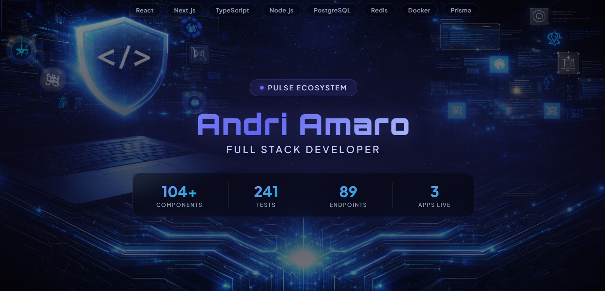
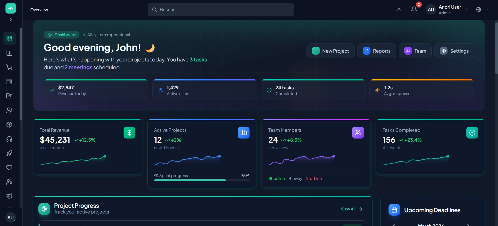
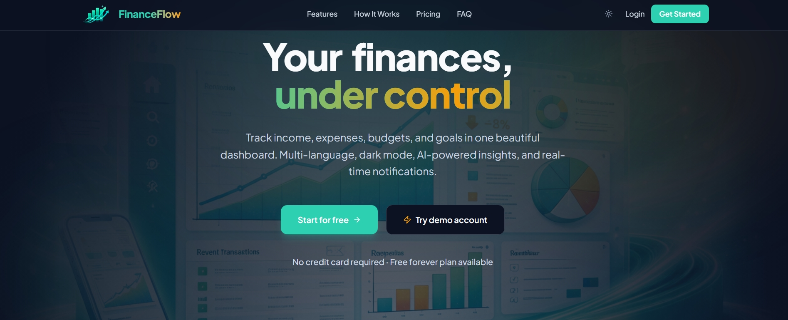
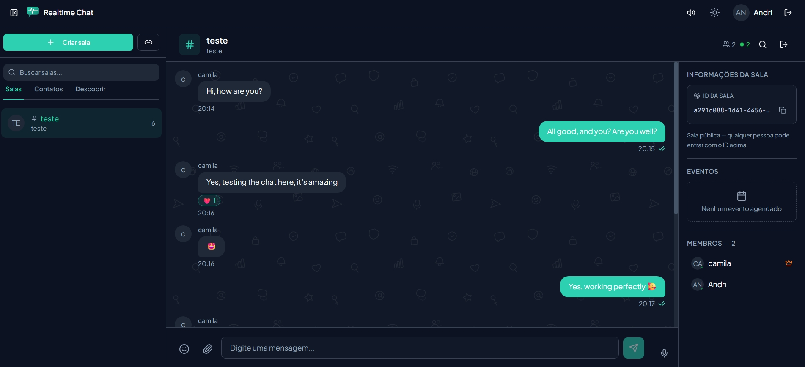

<!-- Banner - Replace with your custom banner -->
<div align="center">
  
</div>

<div align="center">

  
  [](https://linkedin.com/in/andri-amaro)
  [](mailto:andrifullstackdev@gmail.com)

</div>

<br />

<div align="center">
  <samp>Full Stack Developer &middot; Systems Thinker &middot; Creator of the Pulse Ecosystem</samp>
</div>

<br />

I build **production-grade web applications** from design system to deployment.

I created the **Pulse Ecosystem** — a unified design system with **104+ components** that powers multiple SaaS products. Each project is fully tested, deployed, and documented with architecture decision records.

```
  3 apps in production  ·  241 automated tests  ·  89 API endpoints  ·  104+ components
```

> **Currently building:** More apps for the Pulse Ecosystem & preparing templates for the community

---

## The Pulse Ecosystem

> *I don't just build isolated projects — I build an ecosystem.*
> *Every app shares the same design system, architectural patterns, and quality standards.*

<table>
  <tr>
    <td align="center" width="33%">
      <a href="https://github.com/AndriyAmaro/pulse-saas-theme">
        
        <br />
        <strong>Pulse Design System</strong>
      </a>
      <br />
      <sub>The foundation — 104+ components, 41 pages, 3 languages</sub>
      <br /><br />
      
      
    </td>
    <td align="center" width="33%">
      <a href="https://github.com/AndriyAmaro/finance-flow">
        
        <br />
        <strong>Pulse Finance</strong>
      </a>
      <br />
      <sub>Multi-tenant financial SaaS with 143 tests</sub>
      <br /><br />
      
      
      <a href="https://dashboard-finance-swart.vercel.app">
        
      </a>
    </td>
    <td align="center" width="33%">
      <a href="https://github.com/AndriyAmaro/realtime-chat">
        
        <br />
        <strong>Pulse Chat</strong>
      </a>
      <br />
      <sub>Real-time messaging with voice, reactions & rooms</sub>
      <br /><br />
      
      
      <a href="https://realtime-chat-eight-beryl.vercel.app">
        
      </a>
    </td>
  </tr>
</table>

<details>
<summary><strong>Coming Soon</strong></summary>
<br />

| App | Description | Status |
|-----|-------------|--------|
| **Pulse Vexiat** | SaaS Project Management Platform | In Development |
| **Pulse E-commerce** | Full-stack E-commerce Solution | Planned |
| **Pulse AI** | AI Dashboard & Agent Platform | Planned |
| **Pulse CRM** | Lightweight CRM System | Planned |

</details>

---

## What Sets Me Apart

```
  Systems Thinking    I build ecosystems, not just apps
  Quality First       241 automated tests across every project
  Architecture        Documented ADRs, 3-layer backend, scaling strategies
  Production Ready    Vercel + Railway + Docker + CI/CD — nothing sits on localhost
  Documentation       Every decision explained — the "why", not just the "what"
```

---

## Tech Stack

<div align="center">

**Frontend**


**Backend**


**Data & Infrastructure**


**Testing & DevOps**


</div>

---

## By The Numbers

<div align="center">

| Metric | Value |
|:------:|:-----:|
| Design System Components | **104+** |
| Automated Tests | **241** |
| REST API Endpoints | **89** |
| Real-time Events (Socket.io) | **32** |
| Database Models (Prisma) | **23** |
| Docker Services | **5** |
| Languages (i18n) | **3** |
| Architecture Decision Records | **21** |
| Apps in Production | **3** |

</div>

---

## Architecture & Workflow

<div align="center">
<table>
<tr>
<td>

```
         ┌──────────────────────────────┐
         │     PULSE DESIGN SYSTEM      │
         │   104+ Reusable Components   │
         └──────────────┬───────────────┘
                        │
         ┌──────────────┼──────────────┐
         │              │              │
    ┌────▼─────┐  ┌─────▼────┐  ┌─────▼─────┐
    │ FINANCE  │  │   CHAT   │  │  COMING   │
    │ Next.js  │  │  React   │  │  SOON...  │
    │  + Hono  │  │ +Express │  │ Vexiat·AI │
    │143 tests │  │ 98 tests │  │ CRM · LMS │
    └────┬─────┘  └─────┬────┘  └─────┬─────┘
         │              │              │
         └──────────────┼──────────────┘
                        │
    ┌───────────────────▼───────────────────┐
    │       SHARED INFRASTRUCTURE           │
    │ PostgreSQL·Redis·Docker·CI/CD·Vercel  │
    └───────────────────────────────────────┘
```

</td>
</tr>
</table>
</div>

<div align="center">
  
</div>

---

## Let's Connect

<div align="center">

[](https://linkedin.com/in/andri-amaro)
[](mailto:andrifullstackdev@gmail.com)

</div>

---

<div align="center">
  <sub>I believe great software is built with systems thinking, not just code.</sub>
  <br />
  <sub>Every component tested. Every decision documented. Every app deployed.</sub>
  <br /><br />
  
</div>
